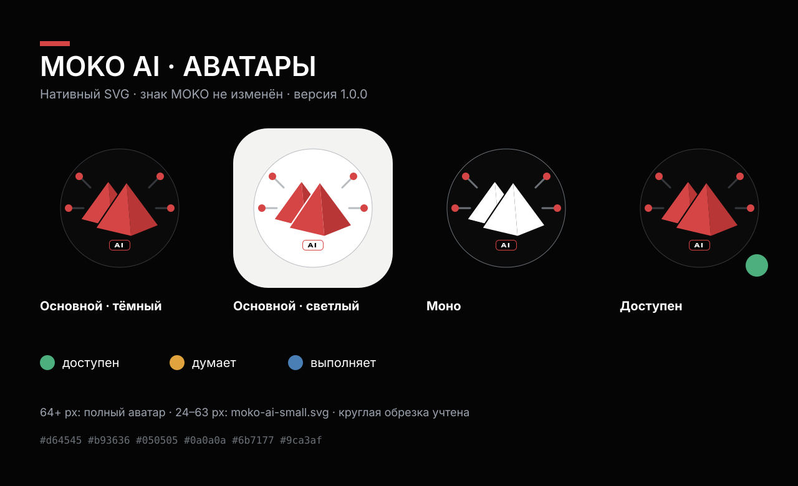

# MOKO AI Brandbook

Отдельный репозиторий айдентики ИИ-аккаунта **MOKO AI**, основанный на официальном брендбуке MOKO Systems.

**Версия:** 1.0.0 · **статус:** стартовый набор · **дата:** 2026-10-03



## Что внутри

- 8 готовых аватаров: основные, моно, компактный, прозрачный и статусы;
- неизменённый фирменный знак MOKO и отдельный векторный шильдик AI;
- 2 стартовых SVG-шаблона для публикаций;
- правила имени, визуального языка, голоса и контента;
- интерактивный одностраничный брендбук `index.html`;
- долговременная память, журнал креативов и принятых решений;
- автоматическая проверка SVG без внешних зависимостей.

## Быстрый выбор аватара

| Задача | Файл |
|---|---|
| Основной аккаунт на тёмном | [`moko-ai-primary-dark.svg`](assets/svg/avatars/moko-ai-primary-dark.svg) |
| Светлый интерфейс | [`moko-ai-primary-light.svg`](assets/svg/avatars/moko-ai-primary-light.svg) |
| Одноцветная печать / слабый контраст | [`moko-ai-mono.svg`](assets/svg/avatars/moko-ai-mono.svg) |
| Иконка 24–63 px | [`moko-ai-small.svg`](assets/svg/avatars/moko-ai-small.svg) |
| Аккаунт доступен | [`moko-ai-online.svg`](assets/svg/avatars/moko-ai-online.svg) |
| Идёт обработка | [`moko-ai-thinking.svg`](assets/svg/avatars/moko-ai-thinking.svg) |
| Идёт выполнение | [`moko-ai-action.svg`](assets/svg/avatars/moko-ai-action.svg) |
| Без фона | [`moko-ai-transparent.svg`](assets/svg/avatars/moko-ai-transparent.svg) |

Главная версия — `moko-ai-primary-dark.svg`. Для круглой обрезки ничего двигать не нужно: безопасная зона уже заложена.

## Принцип

Официальный знак MOKO не перерисован и не перекрашен. ИИ-характер передают только три простых элемента вокруг него:

1. контур сети;
2. шесть узлов;
3. компактный шильдик `AI`.

Это сохраняет узнаваемость MOKO и не превращает аватар в сложную «роботизированную» иллюстрацию.

## Структура

```text
.
├── AGENTS.md                         # инструкция будущим ИИ-сессиям
├── BRANDBOOK.md                      # полные правила
├── CHANGELOG.md
├── index.html                        # визуальная версия брендбука
├── brand.tokens.json                 # машинные токены
├── manifest.json                     # реестр ассетов
├── assets/svg/
│   ├── avatars/                      # готовые аватары
│   ├── components/                   # шильдик AI
│   ├── moko/                         # исходный знак MOKO
│   ├── previews/                     # обзорный лист
│   └── templates/                    # шаблоны креативов
├── docs/
│   ├── CREATIVE-LOG.md               # append-only журнал работ
│   ├── CREATIVE-MEMORY.md            # накопленные знания и ограничения
│   ├── DECISIONS.md                  # почему решения именно такие
│   ├── SOURCES.md                    # источники и происхождение
│   └── BRANCH-HANDOFF-TEMPLATE.md    # передача контекста между ветками
└── scripts/validate_svgs.py
```

## Работа в новой ветке или новой ИИ-сессии

1. Прочитать [`AGENTS.md`](AGENTS.md).
2. Затем прочитать [`docs/CREATIVE-MEMORY.md`](docs/CREATIVE-MEMORY.md) и [`docs/DECISIONS.md`](docs/DECISIONS.md).
3. Создать ветку: `creative/<короткая-тема>`.
4. Разрабатывать мастер только в SVG.
5. Записать ход и результат в [`docs/CREATIVE-LOG.md`](docs/CREATIVE-LOG.md).
6. Обновить память, если появился повторно используемый вывод.
7. Запустить проверку:

```bash
python3 scripts/validate_svgs.py
```

8. Приложить handoff по шаблону из `docs/BRANCH-HANDOFF-TEMPLATE.md`.

## Форматы

Мастер-файл любого визуального креатива — только `.svg`. PNG/WebP можно экспортировать для конкретной площадки, но не хранить как источник и не редактировать вместо SVG.

## Источник фирменной основы

- официальный брендбук: <https://moko.by/brandbook/>
- официальный полноцветный знак: <https://moko.by/images/brand/logo-color.svg>

Подробности и дата фиксации — в [`docs/SOURCES.md`](docs/SOURCES.md).
